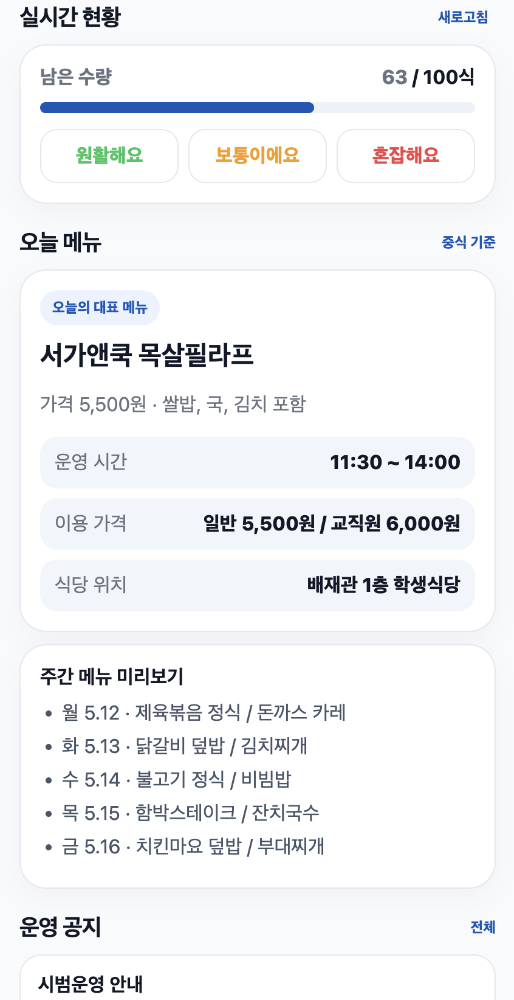
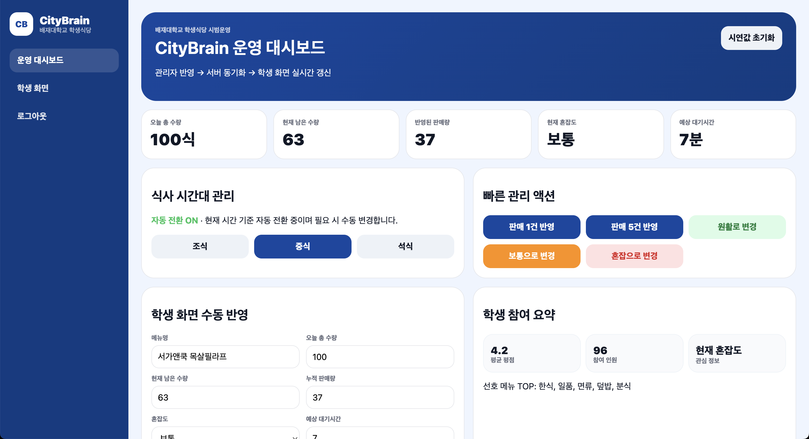

# CityBrain Smart Campus MVP

Smart campus MVP focused on student dining operations, real-time cafeteria visibility, and admin-side operational decision support.

This project was built to explore how a university dining service can provide better information for students and better operational awareness for administrators.

> This repository is a portfolio/demo MVP.  
> It is not an official deployed university service.

---

## Key Technologies

`FastAPI` `SQLite` `Kotlin` `Jetpack Compose`  
`Android Client Structure` `Admin Web` `Student Web` `Smart Campus`  
`Operational Dashboard` `Service MVP`

---

## Architecture

```text
[Student Web]
    menu view / congestion status / student participation
        ↓
[FastAPI Backend]
    menu / congestion / feedback / notice / admin APIs
        ↓
[SQLite Database]
    MVP-level local data storage
        ↑
[Admin Web]
    operation monitoring / menu management / feedback review
        ↑
[Jarvis Assistant]
    local assistant-style query interface for campus dining information
```

---

## Why This Project Exists

Campus dining services often have information gaps between students and operators.

Students want to know:

- what menu is available
- how crowded the cafeteria is
- how many meals are likely left
- how long the expected wait may be
- whether it is worth visiting now

Operators need visibility into:

- student demand
- menu response
- feedback patterns
- congestion status
- operational bottlenecks

CityBrain explores how a smart campus service can connect both sides through a lightweight MVP architecture.

---

## Main Features

- Student cafeteria home screen
- Real-time remaining meal count
- Congestion status display
- Expected waiting time display
- Today menu and weekly menu preview
- Student feedback and survey flow
- Admin operation dashboard
- Menu and quantity management
- Admin-side quick operation actions
- Jarvis-style campus assistant screen
- Status page and API documentation
- Student and admin web interfaces

---

## Engineering-Oriented Features

This project is not just a static UI prototype.

It includes:

- FastAPI backend
- SQLite persistence
- admin/student interface separation
- local demo environment configuration
- API documentation through FastAPI Swagger UI
- service status page
- production gap analysis
- documentation for security and deployment limitations
- Android client structure and Jetpack Compose prototype direction

---

## Production-Readiness Notes

This repository includes documentation for areas that must be improved before real deployment:

| Document | Purpose |
|---|---|
| `docs/DEMO_ACCOUNT_POLICY.md` | Demo account and security boundary |
| `docs/PRODUCTION_GAP.md` | Authentication, privacy, reliability, and deployment gaps |

Before production deployment, the following areas would require additional work:

- student identity verification
- role-based access control
- HTTPS and secure session handling
- privacy policy and consent flow
- production database migration
- monitoring and backup strategy
- accessibility and responsive QA
- Android release signing
- operational incident response process

---

## Quick Start

From the backend directory:

```bash
cd backend

python3 -m venv .venv
source .venv/bin/activate

python -m pip install -r requirements.txt

python -m uvicorn app.main:app --host 0.0.0.0 --port 8000 --reload
```

Student web:

```text
http://127.0.0.1:8000/
```

Admin web:

```text
http://127.0.0.1:8000/admin/login
```

Jarvis assistant:

```text
http://127.0.0.1:8000/jarvis
```

Status page:

```text
http://127.0.0.1:8000/status
```

API docs:

```text
http://127.0.0.1:8000/docs
```

---

## Screenshots

### UI/UX Concept Board

> Prototype concept board for portfolio/demo purposes.  
> This is not an official university service screen.


---

### Student Web





---

### Admin Dashboard



---

### Assistant and Operations


---

## Runtime Flow

```text
1. Admin updates meal quantity / congestion status
2. Backend stores current operation state
3. Student web displays updated cafeteria status
4. Students can check menu, remaining quantity, wait time, and notices
5. Student feedback can support future operation decisions
```

---

## Honest Limits

This MVP does **not** claim:

- production-grade university deployment
- official university service status
- real student identity verification
- complete privacy-policy compliance
- high-availability operation
- store-ready Android release
- full accessibility certification
- real cafeteria system integration

This project is a smart campus MVP focused on service flow, interface structure, and operational feasibility.

---

## Future Improvements

- Add student ID verification
- Add role-based access control
- Add privacy policy and consent flow
- Add production database migration
- Add monitoring and backup strategy
- Add Android release signing
- Add accessibility and responsive QA
- Add real cafeteria operation data integration
- Add kiosk/POS integration scenario
- Add historical demand analytics
- Add admin audit logging

---

## Interview Summary

> CityBrain is a smart campus MVP focused on campus dining operations.  
> I built it to explore how student-facing information and admin-side operational visibility can be connected through a FastAPI backend, SQLite database, student web, admin dashboard, and local assistant-style interface.

---

## Demo / Runbook

CityBrain 시연 및 실행 절차는 아래 문서에 정리했다.

- [CITYBRAIN_RUNBOOK.md](./CITYBRAIN_RUNBOOK.md)
- [CITYBRAIN_CODE_FLOW.md](./CITYBRAIN_CODE_FLOW.md)
- [code-reading-log.md](./code-reading-log.md)

---

## Evidence Package

CityBrain 심사와 시연 때 보여줄 증거 자료는 아래 폴더에 정리했다.

- [evidence/README.md](./evidence/README.md)
- [evidence/screenshots](./evidence/screenshots)
- [evidence/demo-flow](./evidence/demo-flow)
- [evidence/code-structure](./evidence/code-structure)
- [evidence/runbook](./evidence/runbook)
- [evidence/interview-notes](./evidence/interview-notes)

---

## CityBrain V8.3 - YOLO Congestion Estimation Demo

CityBrain V8.3 adds a YOLO-based congestion estimation demo as an alternative data collection path when kiosk/OBU integration is unavailable.

This module is located under:

```text
vision/congestion_demo

The goal is to estimate cafeteria congestion from webcam or RTSP camera streams by detecting people and converting the result into congestion statistics.

Webcam / RTSP Camera
→ YOLO Person Detection
→ People Count / Queue Length
→ Congestion Level
→ CityBrain Student Screen
Run YOLO Congestion Demo
cd vision/congestion_demo

python3 -m venv .venv
source .venv/bin/activate

pip install -r requirements.txt

python app.py

Open:

http://127.0.0.1:8081

API:

http://127.0.0.1:8081/api/congestion/latest
Notes
This is an MVP/demo module.
It supports webcam-based testing and can be extended to RTSP CCTV/IP camera streams.
It does not aim to identify individuals or store original video.
The goal is to calculate congestion statistics based on people count or queue length.
Official deployment would require CCTV policy, privacy, and access permission review.