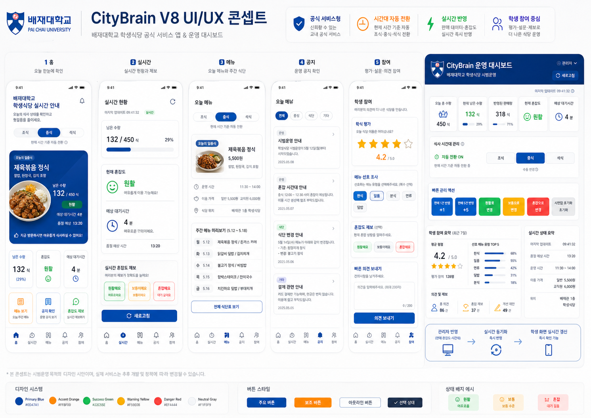
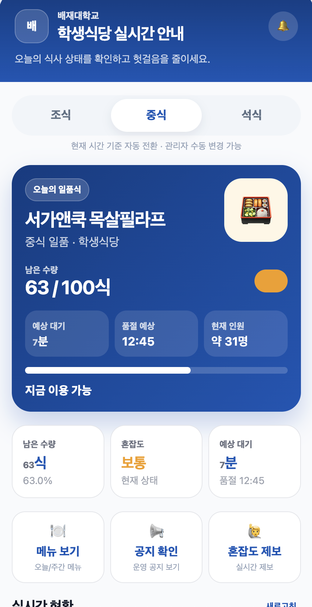
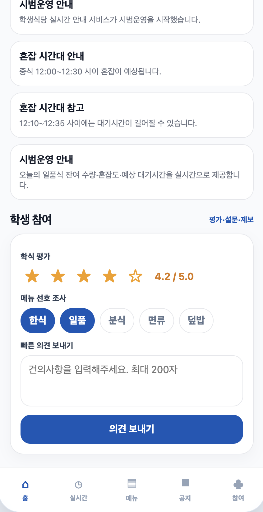
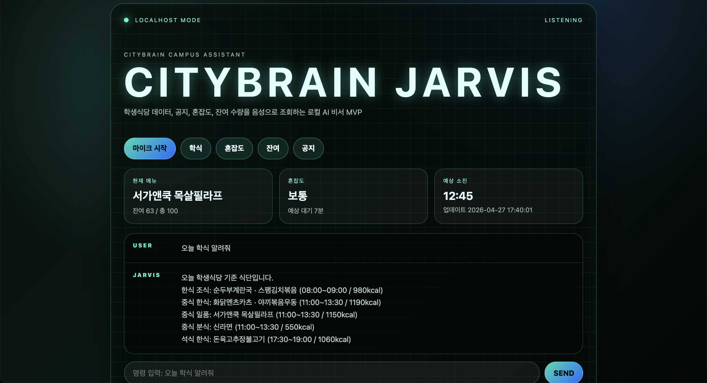
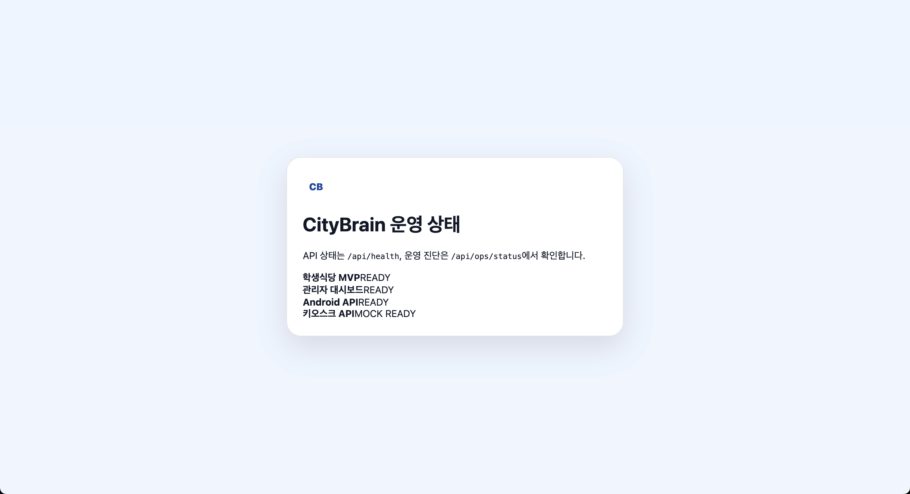
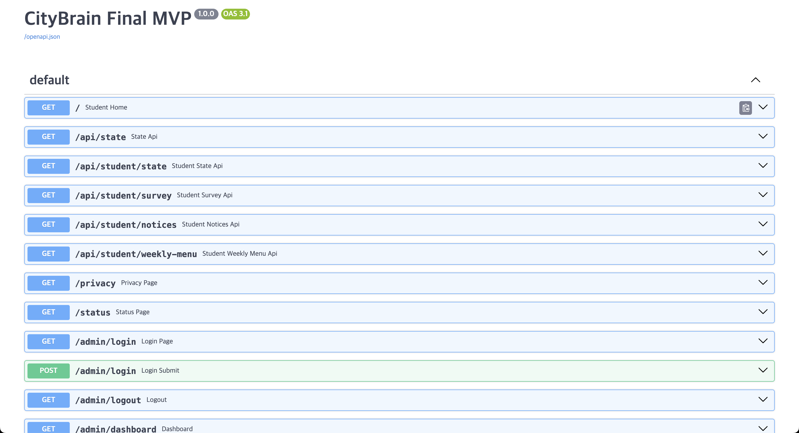

# CityBrain Smart Campus MVP

## Current Status - v9.0 Campus Pilot Ready

CityBrain has evolved from a cafeteria information MVP into a campus dining operation data platform prototype.

Current implementation includes:

- YOLO-based cafeteria congestion detection demo
- CityBrain backend proxy API for vision congestion data
- Student AI congestion status page
- Admin AI congestion operation report
- Vision congestion history logging
- CSV export for recorded congestion data
- Campus pilot proposal document
- Vision privacy and video handling draft
- Operator runbook for local pilot testing

Core pages:

```text
Student Vision Status:
http://127.0.0.1:8080/student/vision-status

Admin Vision Report:
http://127.0.0.1:8080/admin/vision-report

Admin Vision History:
http://127.0.0.1:8080/admin/vision-history

Vision API:
http://127.0.0.1:8080/api/vision/congestion

CSV Export:
http://127.0.0.1:8080/api/vision/history/export.csv
```

This project is still an MVP and not an official deployed university service.

---

Smart campus MVP focused on student dining operations, real-time cafeteria visibility, and admin-side operational decision support.

This project was built to explore how a university dining service can provide better information for students and better operational awareness for administrators.

> This repository is a portfolio/demo MVP.  
> It is not an official deployed university service.

---

## Key Technologies

`FastAPI` `SQLite` `Kotlin` `Jetpack Compose`  
`Android Client Structure` `Admin Web` `Student Web` `Smart Campus`  
`Operational Dashboard` `Service MVP` `YOLO` `Computer Vision`

---

## Architecture

```text
[Student Web]
    menu view / congestion status / student participation
        ↓
[FastAPI Backend]
    menu / congestion / feedback / notice / admin APIs
        ↓
[SQLite Database]
    MVP-level local data storage
        ↑
[Admin Web]
    operation monitoring / menu management / feedback review
        ↑
[Jarvis Assistant]
    local assistant-style query interface for campus dining information
```

---

## Vision-Based Congestion Architecture

```text
[Webcam / RTSP Camera]
        ↓
[YOLO Person Detection Module]
        ↓
[People Count / Congestion Level]
        ↓
[CityBrain Backend Proxy API]
        ↓
[Student Vision Status Page]
        ↓
[Admin Vision Report / History Log / CSV Export]
```

---

## Why This Project Exists

Campus dining services often have information gaps between students and operators.

Students want to know:

- what menu is available
- how crowded the cafeteria is
- how many meals are likely left
- how long the expected wait may be
- whether it is worth visiting now

Operators need visibility into:

- student demand
- menu response
- feedback patterns
- congestion status
- operational bottlenecks

CityBrain explores how a smart campus service can connect both sides through a lightweight MVP architecture.

---

## Main Features

- Student cafeteria home screen
- Real-time remaining meal count
- Congestion status display
- Expected waiting time display
- Today menu and weekly menu preview
- Student feedback and survey flow
- Admin operation dashboard
- Menu and quantity management
- Admin-side quick operation actions
- Jarvis-style campus assistant screen
- Status page and API documentation
- Student and admin web interfaces
- YOLO-based congestion estimation demo
- Student AI congestion status page
- Admin AI congestion report page
- Vision congestion history logging
- CSV export for recorded congestion data

---

## Engineering-Oriented Features

This project is not just a static UI prototype.

It includes:

- FastAPI backend
- SQLite persistence
- admin/student interface separation
- local demo environment configuration
- API documentation through FastAPI Swagger UI
- service status page
- production gap analysis
- documentation for security and deployment limitations
- Android client structure and Jetpack Compose prototype direction
- YOLO-based person detection module
- backend proxy API for vision data
- fallback handling when the vision module is unavailable
- vision history logging and CSV export

---

## Production-Readiness Notes

This repository includes documentation for areas that must be improved before real deployment:

| Document | Purpose |
|---|---|
| `docs/DEMO_ACCOUNT_POLICY.md` | Demo account and security boundary |
| `docs/PRODUCTION_GAP.md` | Authentication, privacy, reliability, and deployment gaps |
| `docs/CAMPUS_PILOT_PROPOSAL.md` | Campus pilot proposal |
| `docs/VISION_PRIVACY_POLICY_DRAFT.md` | Vision privacy and video handling draft |
| `docs/OPERATOR_RUNBOOK_VISION.md` | Vision module operator runbook |

Before production deployment, the following areas would require additional work:

- student identity verification
- role-based access control
- HTTPS and secure session handling
- privacy policy and consent flow
- production database migration
- monitoring and backup strategy
- accessibility and responsive QA
- Android release signing
- operational incident response process
- CCTV access permission review
- camera position and signage review
- school-level privacy and video processing review

---

## Quick Start

From the backend directory:

```bash
cd backend

python3 -m venv .venv
source .venv/bin/activate

python -m pip install -r requirements.txt

python -m uvicorn app.main:app --host 0.0.0.0 --port 8000 --reload
```

Student web:

```text
http://127.0.0.1:8000/
```

Admin web:

```text
http://127.0.0.1:8000/admin/login
```

Jarvis assistant:

```text
http://127.0.0.1:8000/jarvis
```

Status page:

```text
http://127.0.0.1:8000/status
```

API docs:

```text
http://127.0.0.1:8000/docs
```

---

## Vision Module Run

CityBrain vision features require two local servers.

### 1. Run YOLO Vision Module

```bash
cd vision/congestion_demo

python3 -m venv .venv
source .venv/bin/activate

pip install -r requirements.txt

python app.py
```

YOLO vision API:

```text
http://127.0.0.1:8081/api/congestion/latest
```

### 2. Run CityBrain Backend

```bash
cd backend
source ../.venv/bin/activate

uvicorn app.main:app --host 127.0.0.1 --port 8080 --reload
```

CityBrain vision API:

```text
http://127.0.0.1:8080/api/vision/congestion
```

Student vision page:

```text
http://127.0.0.1:8080/student/vision-status
```

Admin vision report:

```text
http://127.0.0.1:8080/admin/vision-report
```

Admin vision history:

```text
http://127.0.0.1:8080/admin/vision-history
```

CSV export:

```text
http://127.0.0.1:8080/api/vision/history/export.csv
```

---

## Screenshots

### UI/UX Concept Board

> Prototype concept board for portfolio/demo purposes.  
> This is not an official university service screen.



---

### Student Web






---

### Admin Dashboard


---

### Assistant and Operations







---

## Runtime Flow

```text
1. Admin updates meal quantity / congestion status
2. Backend stores current operation state
3. Student web displays updated cafeteria status
4. Students can check menu, remaining quantity, wait time, and notices
5. Student feedback can support future operation decisions
```

---

## Vision Runtime Flow

```text
1. Webcam or RTSP camera provides a live frame
2. YOLO module detects people
3. Vision module calculates people count and congestion level
4. CityBrain backend reads the result through /api/vision/congestion
5. Student page displays current AI congestion status
6. Admin report displays operation guidance
7. Admin history page saves logs
8. CSV export allows pilot data review
```

---

## CityBrain V8.3 - YOLO Congestion Estimation Demo

CityBrain V8.3 adds a YOLO-based congestion estimation demo as an alternative data collection path when kiosk/OBU integration is unavailable.

This module is located under:

```text
vision/congestion_demo
```

The goal is to estimate cafeteria congestion from webcam or RTSP camera streams by detecting people and converting the result into congestion statistics.

```text
Webcam / RTSP Camera
→ YOLO Person Detection
→ People Count / Queue Length
→ Congestion Level
→ CityBrain Student Screen
```

### Run YOLO Congestion Demo

```bash
cd vision/congestion_demo

python3 -m venv .venv
source .venv/bin/activate

pip install -r requirements.txt

python app.py
```

Open:

```text
http://127.0.0.1:8081
```

API:

```text
http://127.0.0.1:8081/api/congestion/latest
```

### Notes

- This is an MVP/demo module.
- It supports webcam-based testing and can be extended to RTSP CCTV/IP camera streams.
- It does not aim to identify individuals or store original video.
- The goal is to calculate congestion statistics based on people count or queue length.
- Official deployment would require CCTV policy, privacy, and access permission review.

---

## Campus Pilot Documents

CityBrain의 학교 파일럿 검토를 위한 문서는 아래에 정리했다.

- [CAMPUS_PILOT_PROPOSAL.md](./docs/CAMPUS_PILOT_PROPOSAL.md)
- [VISION_PRIVACY_POLICY_DRAFT.md](./docs/VISION_PRIVACY_POLICY_DRAFT.md)
- [OPERATOR_RUNBOOK_VISION.md](./docs/OPERATOR_RUNBOOK_VISION.md)

---

## Evidence Package

CityBrain 심사와 시연 때 보여줄 증거 자료는 아래 폴더에 정리했다.

- [evidence/README.md](./evidence/README.md)
- [evidence/screenshots](./evidence/screenshots)
- [evidence/demo-flow](./evidence/demo-flow)
- [evidence/code-structure](./evidence/code-structure)
- [evidence/runbook](./evidence/runbook)
- [evidence/interview-notes](./evidence/interview-notes)

---

## Demo / Runbook

CityBrain 시연 및 실행 절차는 아래 문서에 정리했다.

- [CITYBRAIN_RUNBOOK.md](./CITYBRAIN_RUNBOOK.md)
- [CITYBRAIN_CODE_FLOW.md](./CITYBRAIN_CODE_FLOW.md)
- [code-reading-log.md](./code-reading-log.md)
- [docs/OPERATOR_RUNBOOK_VISION.md](./docs/OPERATOR_RUNBOOK_VISION.md)
- [CCTV Privacy and Congestion Research](./docs/RESEARCH_CCTV_PRIVACY_AND_CONGESTION.md)

---

## Honest Limits

This MVP does **not** claim:

- production-grade university deployment
- official university service status
- real student identity verification
- complete privacy-policy compliance
- high-availability operation
- store-ready Android release
- full accessibility certification
- real cafeteria system integration
- fully validated CCTV deployment
- legal approval for real campus video operation
- production-grade AI accuracy

This project is a smart campus MVP focused on service flow, interface structure, field research, and operational feasibility.

---

## Future Improvements

- Add student ID verification
- Add role-based access control
- Add privacy policy and consent flow
- Add production database migration
- Add monitoring and backup strategy
- Add Android release signing
- Add accessibility and responsive QA
- Add real cafeteria operation data integration
- Add kiosk/POS integration scenario
- Add historical demand analytics
- Add admin audit logging
- Add scheduled automatic vision logging
- Add CSV-based weekly operation report
- Add real pilot feedback form
- Add camera-position accuracy testing

---

## Interview Summary

> CityBrain is a smart campus MVP focused on campus dining operations.  
> I built it to explore how student-facing information and admin-side operational visibility can be connected through a FastAPI backend, SQLite database, student web, admin dashboard, local assistant-style interface, and YOLO-based congestion estimation module.

---

## Release Summary

### v8.3

Added YOLO-based congestion estimation demo.

### v8.4

Connected YOLO vision module to CityBrain backend through `/api/vision/congestion`.

### v8.5

Added student-facing AI congestion status page.

### v8.6

Added admin-facing AI congestion operation report.

### v8.7

Added vision congestion history logging.

### v8.8

Added CSV export for recorded congestion data.

### v8.9

Added campus pilot proposal, privacy/video handling draft, and operator runbook.

### v9.0

Packaged the project as a campus pilot-ready MVP.

---

### v9.4 Auto Vision Logging

CityBrain v9.4 adds automatic vision congestion logging.

Admin auto logging page:

    http://127.0.0.1:8080/admin/vision-auto-logging

Auto logging APIs:

    GET  /api/vision/auto-logging/status
    POST /api/vision/auto-logging/start?interval_seconds=60
    POST /api/vision/auto-logging/stop
    POST /api/vision/auto-logging/run-once


---

### v9.5 Vision Operating Window

CityBrain v9.5 adds operating-window control for automatic vision congestion logging.

The auto logging feature can now save congestion records only during a configured time window, such as the lunch peak period.

Default operating window:

    11:30 ~ 13:30

Admin page:

    http://127.0.0.1:8080/admin/vision-auto-logging

Updated API example:

    POST /api/vision/auto-logging/start?interval_seconds=60&start_time=11:30&end_time=13:30&respect_operating_window=true

Status API includes:

    within_operating_window
    operating_start
    operating_end
    skip_count
    last_skipped_at

This makes the vision logging module more suitable for a limited campus cafeteria pilot because the system does not need to collect data outside the intended operation time.

---

### v9.6 Admin Auth Guard

CityBrain v9.6 adds a simple admin key guard for local MVP admin pages and control APIs.

Student-facing pages remain open, but admin pages, CSV export, and auto-logging control APIs require an admin key.

Default local admin key:

    citybrain-local-admin

Admin pages:

    http://127.0.0.1:8080/admin/vision-report?admin_key=citybrain-local-admin
    http://127.0.0.1:8080/admin/vision-history?admin_key=citybrain-local-admin
    http://127.0.0.1:8080/admin/vision-auto-logging?admin_key=citybrain-local-admin

API header example:

    X-Admin-Key: citybrain-local-admin

Curl example:

    curl -H "X-Admin-Key: citybrain-local-admin" http://127.0.0.1:8080/api/vision/auto-logging/status

Environment variable:

    CITYBRAIN_ADMIN_KEY=citybrain-local-admin

This is not a full production login system. It is a lightweight local MVP guard to prevent unauthenticated access to administrator functions during pilot testing.

---

### v9.7 Pilot Report Summary

CityBrain v9.7 adds an admin-only pilot report page based on stored vision congestion logs.

Admin report page:

    http://127.0.0.1:8080/admin/vision-pilot-report?admin_key=citybrain-local-admin

Report API:

    GET /api/vision/pilot-report?limit=1000

The report summarizes:

- total congestion log count
- average detected people
- maximum detected people
- minimum detected people
- congestion-level counts
- hourly average people count
- recent 10 logs
- school-facing summary text

This helps convert raw congestion logs into a pilot operation summary that can be reviewed by school staff or cafeteria operators.
